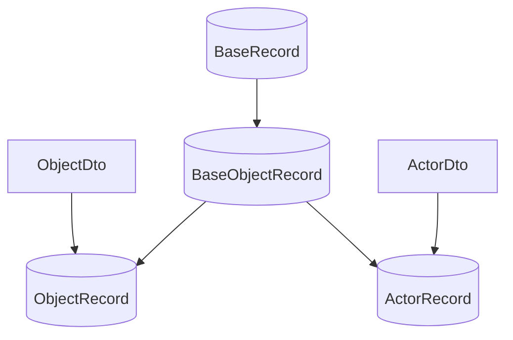

# Yuforium DTOs and Records
DTOs (data transfer objects) are used by Yuforium to transfer data from clients to a backend database.  They contain OpenAPI, Validator, Transformer, and Mongoose Schema decorators, therefore schema information is annotated in the DTOs, along with client side validation.

Records for MongoDB are instantiated via mixins, which take a DTO as input and return a Record from which a Schema may be derived.

